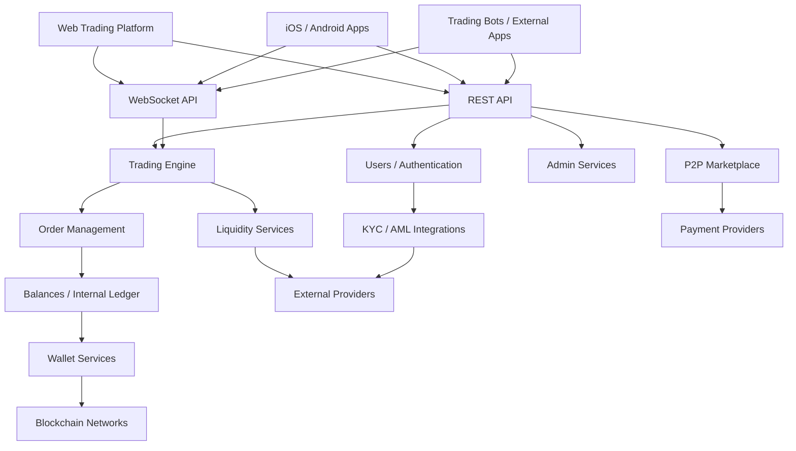
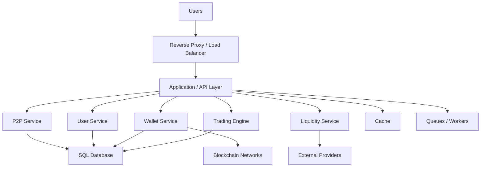

<div align="center">

# CryptoTech

### Self-Hosted Cryptocurrency Exchange Software with Complete Source Code

**Full Source Code · Self-Hosted · No Vendor Lock-In**

Trusted by 300+ customers worldwide.

Build and launch your own cryptocurrency exchange with complete source code, support for 1,000+ digital assets, and a high-performance matching engine capable of processing up to 250,000 orders per second.

<br>

[](https://cryptotech.exchange/)
[](https://demo.cryptotech.exchange/)
[](https://guide.cryptotech.exchange/)
[](https://cryptotech.exchange/crypto-exchange-source-code)
[](https://cryptotech.exchange/pricing)

<br>

<p align="center">
  
</p>

<br>

**Matching Engine · Wallets · Admin Panel · KYC/AML · Liquidity · P2P · REST API · WebSocket API · Mobile Apps**

<br>

[Website](https://cryptotech.exchange/) •
[Crypto Exchange Source Code](https://cryptotech.exchange/crypto-exchange-source-code) •
[Documentation](https://guide.cryptotech.exchange/) •
[Live Demo](https://demo.cryptotech.exchange/) •
[Pricing](https://cryptotech.exchange/pricing)

</div>

---

## Table of Contents

- [About CryptoTech](#about-cryptotech)
- [Why CryptoTech](#why-cryptotech)
- [Platform Overview](#platform-overview)
- [Architecture](#architecture)
- [Trading Engine](#trading-engine)
- [Wallet Infrastructure](#wallet-infrastructure)
- [P2P Marketplace](#p2p-marketplace)
- [Liquidity Integration](#liquidity-integration)
- [KYC AML and Security](#kyc-aml-and-security)
- [REST and WebSocket APIs](#rest-and-websocket-apis)
- [Admin Panel](#admin-panel)
- [Mobile Applications](#mobile-applications)
- [Crypto and Fiat Support](#crypto-and-fiat-support)
- [Customization](#customization)
- [Self-Hosted Deployment](#self-hosted-deployment)
- [Technology Stack](#technology-stack)
- [Documentation](#documentation)
- [CryptoTech vs Closed SaaS](#cryptotech-vs-closed-saas)
- [Who CryptoTech Is For](#who-cryptotech-is-for)
- [FAQ](#faq)
- [Commercial Software Notice](#commercial-software-notice)
- [Security](#security)
- [Support](#support)
- [Get Started](#get-started)

---

# About CryptoTech

**CryptoTech** is production-ready cryptocurrency exchange software built for businesses that want to launch, customize, and operate their own digital-asset trading platform.

The platform is designed around three core principles:

> **Complete Source Code**  
> **Self-Hosted Deployment**  
> **Long-Term Technology Control**

Unlike closed SaaS exchange solutions, CryptoTech is built for companies that want access to the underlying application source code and the ability to deploy the platform on infrastructure they control.

Licensed customers can customize the platform across:

- Frontend design
- Backend logic
- Trading functionality
- Wallet infrastructure
- Supported assets
- KYC/AML integrations
- Liquidity providers
- P2P workflows
- APIs
- Admin tools
- Mobile applications
- Deployment architecture

> CryptoTech is proprietary commercial software with source-code access. It is not distributed as an open-source project.

---

# Why CryptoTech

CryptoTech is designed for businesses that need more than a rebranded hosted platform.

| Capability | CryptoTech |
|---|---|
| Complete commercial source-code access | ✅ |
| Self-hosted deployment | ✅ |
| Frontend customization | ✅ |
| Backend customization | ✅ |
| Trading-engine customization | ✅ |
| API extensibility | ✅ |
| Custom blockchain integrations | ✅ |
| Custom wallet integrations | ✅ |
| Custom KYC/AML integrations | ✅ |
| Custom liquidity integrations | ✅ |
| Custom P2P workflows | ✅ |
| Mobile applications | ✅ |
| Infrastructure control | ✅ |
| Own branding | ✅ |
| Reduced vendor dependency | ✅ |

### What that means in practice

With CryptoTech, your development team can:

- Change the user interface
- Modify backend workflows
- Add new assets
- Integrate additional blockchains
- Connect new payment providers
- Change fees
- Extend APIs
- Integrate external liquidity
- Add or replace KYC providers
- Customize admin workflows
- Extend mobile functionality
- Deploy on your own servers or cloud infrastructure

---

# Platform Overview

CryptoTech can include the core components required to operate a modern centralized cryptocurrency exchange.

| Module | Purpose |
|---|---|
| **Spot Trading** | Buy and sell crypto assets across configured markets |
| **Matching Engine** | Process and match buy and sell orders |
| **Order Book** | Real-time bid and ask management |
| **Multi-Currency Wallets** | Deposits, withdrawals and internal transfers |
| **Internal Ledger** | User balance and locked-balance accounting |
| **Admin Panel** | Centralized platform management |
| **KYC / AML** | Identity verification and compliance integrations |
| **Liquidity** | External market and liquidity connectivity |
| **P2P Trading** | Peer-to-peer marketplace with escrow workflows |
| **REST API** | Application and external-service integrations |
| **WebSocket API** | Real-time market and account events |
| **Mobile Apps** | iOS and Android applications |
| **Blockchain Integrations** | Additional networks, assets and wallet providers |
| **Payment Integrations** | Fiat and external payment-provider connectivity |

---

# Architecture

CryptoTech follows an API-driven architecture that allows different platform components to communicate through dedicated services and interfaces.



This architecture can be adapted according to infrastructure, performance, integration, and deployment requirements.

---

# Trading Engine

The trading engine is responsible for processing buy and sell orders across supported markets.

### Core capabilities

- Market orders
- Limit orders
- Multiple trading pairs
- Real-time order books
- Trade execution
- Price matching
- Order history
- Trade history
- Trading fees
- Real-time market updates
- API-based trading
- External liquidity connectivity

### Simplified order lifecycle

```text
User Creates Order
        ↓
Validate Request
        ↓
Check Available Balance
        ↓
Reserve Required Funds
        ↓
Send Order to Matching Engine
        ↓
Match Against Order Book
        ↓
Create Trade
        ↓
Update Orders
        ↓
Update Balances
        ↓
Broadcast Real-Time Events
```

### Why source-code access matters

Because the trading engine is part of the commercial source code, it can be customized according to:

- Trading model
- Fee structure
- Market structure
- Liquidity model
- Infrastructure requirements
- Business logic

---

# Wallet Infrastructure

CryptoTech includes a multi-currency wallet system for managing digital-asset operations across the exchange.

### Wallet functionality

- Cryptocurrency deposits
- Cryptocurrency withdrawals
- Internal transfers
- Multiple blockchain networks
- Hot-wallet workflows
- Cold-wallet workflows
- Deposit monitoring
- Withdrawal management
- Wallet-provider integrations
- Blockchain-node integrations
- Custom asset integrations

### Internal trading balances

Blockchain balances and exchange trading balances are separate concepts.

```text
Blockchain Network
        ↓
Deposit Detection
        ↓
Confirmation Processing
        ↓
Wallet Service
        ↓
Internal Exchange Balance
        ↓
Trading Engine
```

This architecture allows users to trade internally without creating a blockchain transaction for every exchange trade.

### Withdrawal flow

```text
Withdrawal Request
        ↓
Balance Validation
        ↓
Security Checks
        ↓
Approval / Risk Rules
        ↓
Wallet Service
        ↓
Blockchain Transaction
        ↓
Status Monitoring
```

---

# P2P Marketplace

CryptoTech can include a peer-to-peer cryptocurrency marketplace alongside standard spot trading.

### P2P functionality

- Buy offers
- Sell offers
- Merchant accounts
- Custom payment methods
- Trade limits
- Escrow workflows
- Configurable fees
- Trade status management
- Dispute handling
- Administrative controls

### Typical P2P flow

```text
Merchant Creates Offer
        ↓
Buyer Opens Trade
        ↓
Crypto Locked in Escrow
        ↓
Buyer Makes Fiat Payment
        ↓
Seller Confirms Payment
        ↓
Crypto Released
```

P2P functionality can be adapted to regional payment systems and target-market requirements.

---

# Liquidity Integration

A new exchange often requires external liquidity to maintain active order books and market depth.

CryptoTech can integrate with:

- External exchanges
- Market makers
- Institutional liquidity providers
- Price-feed providers
- Trading APIs
- Order-routing services
- Liquidity aggregation systems

### Example liquidity architecture

```text
CryptoTech Exchange
        ↓
Liquidity Integration Layer
   ├── External Exchange
   ├── Liquidity Provider
   ├── Market Maker
   └── Price Feed
```

Using an integration layer makes it easier to add, replace, or combine external providers.

---

# KYC, AML and Security

CryptoTech supports integration-ready compliance and security workflows.

## KYC / AML Integrations

The platform can connect to third-party services for:

- Identity verification
- KYC workflows
- AML workflows
- Account verification
- Compliance review
- Administrative approval

## Security Capabilities

Depending on deployment and configuration, platform security can include:

- Two-factor authentication
- Account protection
- Withdrawal controls
- Rate limiting
- Administrative permissions
- Secure data handling
- Activity monitoring
- Audit-oriented workflows

> Compliance requirements vary by jurisdiction and business model. Exchange operators are responsible for meeting applicable legal and regulatory requirements.

---

# REST and WebSocket APIs

CryptoTech provides API connectivity for frontend applications, mobile apps, trading tools, liquidity providers, wallet services, and third-party integrations.

## REST API

Typical REST API use cases include:

- Markets
- Trading pairs
- Orders
- Trades
- User accounts
- Wallet balances
- Deposits
- Withdrawals
- Administrative integrations

Example conceptual endpoints:

```text
GET    /api/markets
GET    /api/orderbook
GET    /api/trades
POST   /api/orders
DELETE /api/orders/{id}
GET    /api/wallets
POST   /api/withdrawals
```

## WebSocket API

Real-time events can include:

```text
market.updated
orderbook.updated
trade.executed
order.updated
balance.updated
```

### Integration targets

CryptoTech APIs can connect:

- Trading bots
- Mobile applications
- External exchanges
- Market makers
- Liquidity providers
- Payment systems
- Wallet services
- Blockchain services
- KYC / AML services
- Analytics tools
- Internal business systems

---

# Admin Panel

CryptoTech includes a centralized administrative environment for operating the exchange.

## User Management

- User accounts
- Account status
- Verification review
- User activity
- Security controls

## Trading Management

- Markets
- Trading pairs
- Trading fees
- Supported assets
- Trading settings

## Wallet Operations

- Deposits
- Withdrawals
- Wallet configuration
- Transaction review

## P2P Administration

- Merchant management
- Offers
- Trades
- Payment methods
- Disputes
- Fees

## Platform Controls

- Exchange configuration
- Integrations
- Administrative permissions
- Operational settings

---

# Mobile Applications

CryptoTech supports customizable mobile applications for:

- iOS
- Android

Mobile users can access:

- Markets
- Trading
- Wallet balances
- Deposits
- Withdrawals
- Account management
- Security settings

The mobile applications connect to the same backend services and API infrastructure used by the web platform.

---

# Crypto and Fiat Support

CryptoTech can support integration of:

- Cryptocurrencies
- Stablecoins
- Custom tokens
- Blockchain assets
- Fiat currencies
- Payment gateways
- Fiat payment providers

Additional assets and networks can be integrated according to project requirements.

### Extendable asset support

```text
CryptoTech
   ├── Bitcoin
   ├── Ethereum / EVM Networks
   ├── Stablecoins
   ├── Custom Tokens
   ├── Additional Blockchains
   └── External Wallet Providers
```

---

# Customization

CryptoTech is designed to be customized at multiple layers.

## Frontend

- Branding
- Layout
- Colors
- Trading interface
- User dashboard
- Registration
- Onboarding
- Localization

## Backend

- Business logic
- Trading rules
- Fee structures
- User workflows
- API endpoints
- Administrative workflows

## Integrations

- Blockchain networks
- Wallet providers
- Payment providers
- KYC / AML providers
- Liquidity providers
- Market-data providers
- External business systems

## Infrastructure

- Hosting
- Databases
- Queues
- Caching
- Monitoring
- Scaling strategy
- Network architecture

---

# Self-Hosted Deployment

CryptoTech can be deployed on infrastructure controlled by the customer.

Possible environments include:

- Dedicated servers
- Private cloud
- Public cloud
- Hybrid infrastructure
- Custom deployment environments

### Self-hosted deployment gives you control over

- Hosting
- Security policies
- Scaling
- Database architecture
- Monitoring
- Backups
- Network architecture
- Deployment process
- External integrations

### Example deployment



The infrastructure can be scaled as user activity, trading volume, supported assets, and integrations grow.

---

# Technology Stack

CryptoTech uses a modern web application architecture.

| Layer | Technology / Approach |
|---|---|
| **Backend** | Laravel |
| **Frontend** | Vue |
| **Architecture** | Separate Laravel API + Vue frontend |
| **API** | REST |
| **Real-Time Communication** | WebSocket |
| **Database** | Relational SQL database |
| **Deployment** | Linux / cloud / self-hosted |
| **Mobile Applications** | iOS & Android |
| **External Integrations** | Blockchain, wallet, KYC/AML, payment and liquidity APIs |

For additional technical information:

**https://guide.cryptotech.exchange/**

---

# Documentation

CryptoTech has dedicated documentation available at:

## [guide.cryptotech.exchange](https://guide.cryptotech.exchange/)

Use the documentation for:

- Platform configuration
- Exchange administration
- Technical reference
- Integration guidance
- Deployment information
- Platform workflows
- Developer reference

<div align="center">

[](https://guide.cryptotech.exchange/)

</div>

---

# CryptoTech vs Closed SaaS

The main difference between CryptoTech and a traditional closed exchange platform is technology control.

| Capability | CryptoTech | Typical Closed SaaS |
|---|---:|---:|
| Complete source-code access | ✅ | Often ❌ |
| Self-hosted deployment | ✅ | Often ❌ |
| Frontend customization | ✅ | Limited |
| Backend customization | ✅ | Limited |
| Trading logic customization | ✅ | Provider dependent |
| Infrastructure control | ✅ | Provider controlled |
| Custom API development | ✅ | Limited |
| Custom integrations | ✅ | Provider dependent |
| Wallet customization | ✅ | Provider dependent |
| KYC provider flexibility | ✅ | Often limited |
| Liquidity provider flexibility | ✅ | Provider dependent |
| Development roadmap control | ✅ | Provider controlled |
| Own branding | ✅ | ✅ |
| Reduced vendor dependency | ✅ | ❌ |

### White-label branding is not the same as technology ownership

A hosted platform can allow:

- Logo changes
- Custom colors
- Custom domain
- Basic configuration

while still keeping the underlying backend closed.

CryptoTech is built for businesses that want control beyond branding.

---

# Who CryptoTech Is For

CryptoTech can serve as a technology foundation for:

- Cryptocurrency exchange startups
- Fintech companies
- Blockchain businesses
- Digital-asset companies
- Payment companies
- Regional exchanges
- Existing trading platforms
- Enterprises entering digital assets
- Development agencies
- Technical teams building custom trading products

---

# FAQ

<details>
<summary><strong>What is CryptoTech?</strong></summary>

CryptoTech is commercial cryptocurrency exchange software designed for businesses that want to launch and operate their own trading platform with complete source-code access and self-hosted deployment.

</details>

<details>
<summary><strong>Do I receive the complete source code?</strong></summary>

Yes. Licensed customers receive complete application source-code access according to the applicable CryptoTech license or purchase agreement.

</details>

<details>
<summary><strong>Is CryptoTech open source?</strong></summary>

No. CryptoTech is proprietary commercial software provided with source-code access. The application source code is not publicly distributed under an open-source license.

</details>

<details>
<summary><strong>Can CryptoTech be deployed on my own servers?</strong></summary>

Yes. CryptoTech is designed for self-hosted deployment on infrastructure controlled by your organization.

</details>

<details>
<summary><strong>Can the frontend be customized?</strong></summary>

Yes. Branding, layout, trading interface, dashboards, onboarding, and other frontend elements can be customized.

</details>

<details>
<summary><strong>Can the backend be customized?</strong></summary>

Yes. Backend business logic, APIs, integrations, trading workflows, fees, administrative tools, and other components can be modified according to project requirements.

</details>

<details>
<summary><strong>Can additional cryptocurrencies and blockchain networks be added?</strong></summary>

Yes. Additional cryptocurrencies, tokens, blockchain networks, wallet providers, and related services can be integrated.

</details>

<details>
<summary><strong>Does CryptoTech support P2P trading?</strong></summary>

CryptoTech can include P2P marketplace functionality with merchant offers, payment methods, escrow workflows, limits, fees, disputes, and administrative controls.

</details>

<details>
<summary><strong>Can I integrate my own KYC or AML provider?</strong></summary>

Yes. Third-party KYC, AML, identity-verification, and compliance providers can be integrated according to project requirements.

</details>

<details>
<summary><strong>Can external liquidity providers be connected?</strong></summary>

Yes. CryptoTech can integrate with external exchanges, market makers, liquidity providers, pricing feeds, and other market infrastructure.

</details>

<details>
<summary><strong>Does CryptoTech support mobile apps?</strong></summary>

Yes. CryptoTech supports customizable iOS and Android mobile applications connected to the exchange backend and API layer.

</details>

<details>
<summary><strong>Can I customize fees, markets, and supported assets?</strong></summary>

Yes. Trading configuration, fees, supported assets, trading pairs, and related business rules can be customized.

</details>

<details>
<summary><strong>Is CryptoTech a hosted SaaS platform?</strong></summary>

CryptoTech is designed around self-hosted deployment and source-code access rather than permanent dependency on a closed SaaS environment.

</details>

---

# Commercial Software Notice

This public GitHub repository is intended for:

- Product information
- Technical overview
- Architecture documentation
- Developer discovery
- Documentation access
- Platform reference

The proprietary CryptoTech application source code is **not publicly distributed through this repository**.

Source-code access is provided to licensed customers according to the applicable commercial license or purchase agreement.

For licensing information:

**https://cryptotech.exchange/crypto-exchange-source-code**

---

# Security

Please do not publish any of the following in public GitHub issues:

- Security vulnerabilities
- Private keys
- API secrets
- Passwords
- Customer information
- Sensitive server configuration
- Internal infrastructure details

See [`SECURITY.md`](SECURITY.md) for responsible disclosure information.

---

# Support

For CryptoTech product, licensing, deployment, customization, integration, or technical inquiries:

| Resource | Link |
|---|---|
| **Official Website** | https://cryptotech.exchange/ |
| **Crypto Exchange Source Code** | https://cryptotech.exchange/crypto-exchange-source-code |
| **Documentation** | https://guide.cryptotech.exchange/ |
| **Live Demo** | https://demo.cryptotech.exchange/ |
| **Pricing** | https://cryptotech.exchange/pricing |

See [`SUPPORT.md`](SUPPORT.md) for repository support information.

---

# Get Started

<div align="center">

## Launch Your Own Cryptocurrency Exchange

Start with production-ready exchange software while maintaining control over your source code, infrastructure, branding, integrations, and future development.

<br>

[](https://cryptotech.exchange/crypto-exchange-source-code)

[](https://demo.cryptotech.exchange/)

[](https://guide.cryptotech.exchange/)

[](https://cryptotech.exchange/pricing)

<br><br>

### CryptoTech

**Full Source Code · Self-Hosted · No Vendor Lock-In**

<sub>Commercial cryptocurrency exchange software for businesses building their own digital-asset trading platforms.</sub>

</div>
